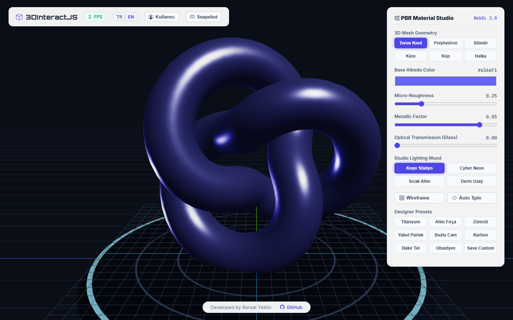

# 3DInteractJS
> Interactive PBR 3D Material Studio • WebGL 2.0 & Three.js CAD Configurator

[](https://3dinteract.web.app)
[](LICENSE)
[](https://threejs.org)
[](https://developer.mozilla.org)
[](https://3dinteract.web.app)

---

## Preview

### CAD Workbench & PBR Material Studio
Dark PBR grid workbench, rotation pedestal, neon target ring, floating white parameter controls, and modern bottom HUD pill badge:


---

## Key Features

### Professional CAD & PBR Studio Architecture
- Immediate Interactive Access: Launches directly into full-viewport 3D workbench without login barriers.
- Dark CAD Grid & PBR Stage: Industrial design environment inspired by Blender, Maya, and SolidWorks featuring coordinate axes, orientation compass, and turntable floor.
- Floating White HUD Overlays:
  - Top-left branding, live FPS performance monitor, bilingual selector, and high-resolution PNG snapshot capture.
  - Right-side real-time physical material parameter adjustment panel.
  - Bottom subtle floating attribution pill badge (Developed by Beraat Yetkin - GitHub).

### Real-Time Physically Based Rendering (PBR) Controls
- 3D Model Geometries: Torus Knot, Polyhedron, Cylinder, Sphere, Cube, and Ring meshes.
- Surface Material Properties:
  - Base Color (Hex Color Picker).
  - Micro Roughness (0.00 - 1.00).
  - Metalness (0.00 - 1.00).
  - Optical Transmission / Glass (0.00 - 1.00).
- Studio Lighting Environments: Dark Studio, Cyber Neon, Warm Gold, and Deep Space HDRI configurations.
- Wireframe and Auto-Rotation orbital camera modes.
- Curated Designer Presets: Titanium, Brushed Gold, Emerald, Ruby Gloss, Frosted Glass, Carbon, Copper Wire, Obsidian.

### Bilingual Support (English | Turkish)
- Instant language toggle switching all mesh labels, material controls, lighting modes, and preset buttons between English and Turkish.
- Default language is English.

---

## Tech Stack

| Layer | Technology | Description |
| :--- | :--- | :--- |
| 3D Rendering | Three.js r128 (WebGL 2.0) | MeshPhysicalMaterial, OrbitControls, shadow mapping |
| UI & HUD | HTML5, CSS3 Glassmorphism | Floating white translucent panels, modern typography |
| Icons | Bootstrap Icons v1.11.3 | Studio tool icons |
| Hosting | Firebase Hosting | High-speed global edge distribution |

---

## Directory Structure

```
3DInteractJsScript/
├── index.html              # 3D engine, WebGL canvas, and HUD controls
├── docs/                   # Documentation assets and screenshots
│   └── preview.png         # High-resolution CAD studio preview
└── README.md               # Project documentation
```

---

## Getting Started

1. Clone the repository:
   ```bash
   git clone https://github.com/kubrvk/3DInteractJsScript.git
   cd 3DInteractJsScript
   ```
2. Open `index.html` directly in your browser:
   ```bash
   start index.html
   ```
3. Alternatively, serve with any local HTTP server:
   ```bash
   npx serve .
   ```
4. Access `http://localhost:3000` in your browser.

---

## Live System

- Live URL: [https://3dinteract.web.app](https://3dinteract.web.app)

---

## Author

Developed by Beraat Yetkin
- GitHub: [@kubrvk](https://github.com/kubrvk)
- Repository: [3DInteractJsScript](https://github.com/kubrvk/3DInteractJsScript)
- Portfolio: [Beraat Yetkin Portfolio](https://github.com/kubrvk/portfolio)
